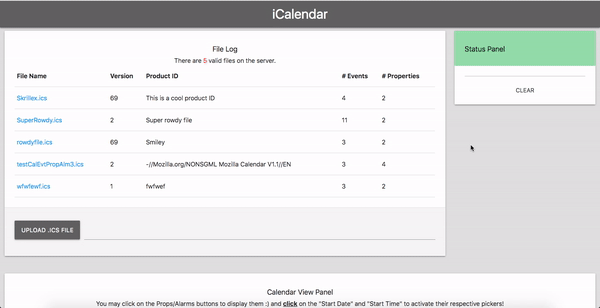

# Calendar App (School Project)

## Summary

* It takes an .ics file as input, or lets you create your own
* Parses and validates the file
* Allows you to explore the file and modify some basic components (like Events)

This is a class project for my Software System Development and Integration course. Due to the assignment being completed under a lot of time pressure and with much less expereince, code and styling are bit messy. 

## How to install & run

Make sure to have `gcc`, `node` and `npm` installed prior to starting!

After you clone the repo:
 ```bash
 cd CaendarAplp/
 npm install
 cd parser
 make
 cd ../
 ```
 If you are on **MacOS**, you have to do an extra step:
 ```bash
 cp libcal.so libcal.so.dylib
 cp liblist.so liblist.so.dylib
 ```
 Lastly (you can replace the 1337 with any port you want)
 ```bash
 node app.js 1337
 ```
 Then open up a browser and navigate to: `localhost:1337`!
 
## How it works (under the hood)

* Calendar parsing, validation, and modification is done using a [*~2k loc* library written entriely in C](https://github.com/chopgye/ics-calendar-parser/blob/master/CalendarApp/parser/src/CalendarParser.c) 
* Users can upload or interact with existing calendars by hitting numerous [API endpoints made with NodeJS](https://github.com/chopgye/ics-calendar-parser/blob/master/CalendarApp/app.js)
* Users can view Calendars, Events, and Alarms in the [client made with HTML/CSS/JavaScript](https://github.com/chopgye/ics-calendar-parser/tree/master/CalendarApp/public)
* There was also a filtering component made with MySQL - but it is not included here for security purposes

## Demo


